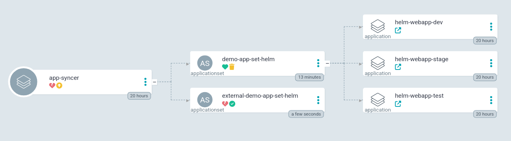
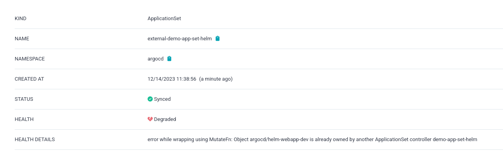

# Introduction
This is description of ArgoCD ApplicationSet renaming process. We will be renaming ApplicationSet from original name 'demo-app-set-helm' to 'external-demo-app-set-helm'.


# Initial setup
Please see our [ApplicationSet for reference](argo-apps/application-set.yaml).
ApplicationSet creates three Applications based on config subdirectories list containing helm values.yaml files. Our ApplicationSet should be configured as follows, to prevent deletion of child resources:

```
apiVersion: argoproj.io/v1alpha1
kind: ApplicationSet
metadata:
  name: demo-app-set-helm
  namespace: argocd
  annotations:
    argocd.argoproj.io/sync-options: Prune=false
spec:
...
  syncPolicy:
    preserveResourcesOnDeletion: true
```

# Renaming process

## Change ApplicationSet name and perform sync
Change ApplicationSet /metadata/name value from 'demo-app-set-helm' to 'external-demo-app-set-helm' and sync. You should see the following state in ArgoCD UI:

As you can see, both old and new ApplicationSets are present in UI. Please note, that when you go into 'external-demo-app-set-helm' ApplicationSet details you will see error message saying, that child Application 'helm-webapp-dev' is owned by another ApplicationSet 'demo-app-set-helm' - the one with old name.

